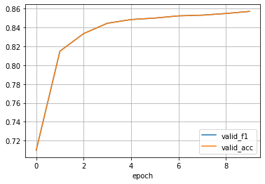

# Kaggle: [Plant Pathology 2021 - FGVC8](https://www.kaggle.com/c/plant-pathology-2021-fgvc8)


[](https://github.com/Borda/kaggle_plant-pathology/actions/workflows/code-format.yml)
[](https://codecov.io/gh/Borda/kaggle_plant-pathology)
[](https://results.pre-commit.ci/latest/github/Borda/kaggle_plant-pathology/main)

Foliar (leaf) diseases pose a major threat to the overall productivity and quality of apple orchards.
The current process for disease diagnosis in apple orchards is based on manual scouting by humans, which is time-consuming and expensive.

The main objective of the competition is to develop machine learning-based models to accurately classify a given leaf image from the test dataset to a particular disease category, and to identify an individual disease from multiple disease symptoms on a single leaf image.


## Experimentation

### install this tooling

A simple way how to use this basic functions:

```bash
! pip install https://github.com/Borda/kaggle_plant-pathology/archive/main.zip
```

### run notebooks in Kaggle

- [Plant Pathology with Flash](https://www.kaggle.com/jirkaborovec/plant-pathology-with-pytorch-lightning-flash)
- [Plant Pathology with Lightning ⚡](https://www.kaggle.com/jirkaborovec/plant-pathology-with-lightning)
- [Plant Pathology with Lightning \[predictions\]](https://www.kaggle.com/jirkaborovec/plant-pathology-with-lightning-predictions)

### run notebooks in Colab

- [Plant pathology with Lightning](https://colab.research.google.com/github/Borda/kaggle_plant-pathology/blob/main/notebooks/Plant-Pathology-with-Lightning.ipynb)
- [Plant pathology with Lightning - StandAlone](https://colab.research.google.com/github/Borda/kaggle_plant-pathology/blob/main/notebooks/Plant-Pathology-with-Lightning_standalone.ipynb) (without this package)
- [Plant pathology with Flash](https://colab.research.google.com/github/Borda/kaggle_plant-pathology/blob/main/notebooks/Plant-Pathology-with-Flash.ipynb)

I would recommend uploading the dataset to you personal gDrive and then in notebooks connect the gDrive which saves you lost of time with re-uploading dataset when ever your Colab is reset... :\]

### some results

Training progress with ResNet50 with training  for 10 epochs > over 96% validation accuracy:



### More reading

- [Practical Lighting Tips to Rank on Kaggle Image Challenges](https://devblog.pytorchlightning.ai/practical-tips-to-rank-on-kaggle-image-challenges-with-lightning-242e2e533429)
