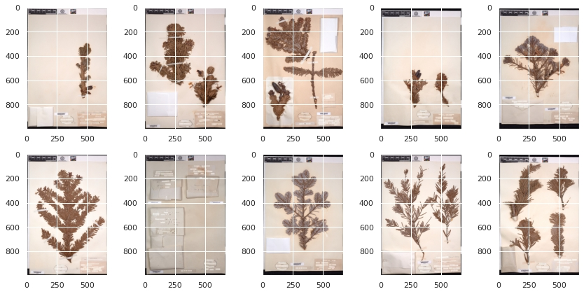
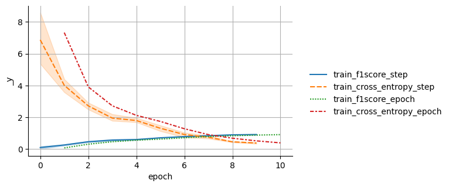
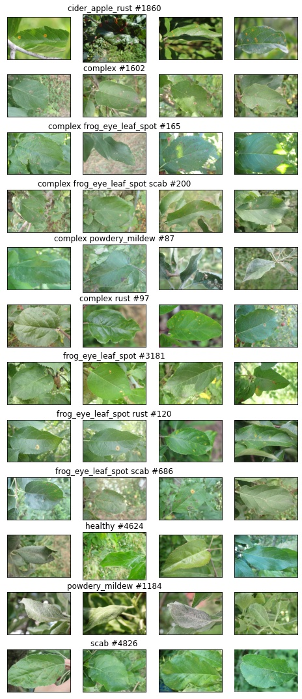
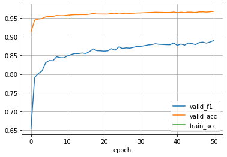
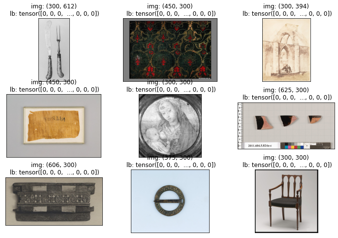
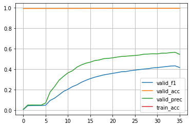
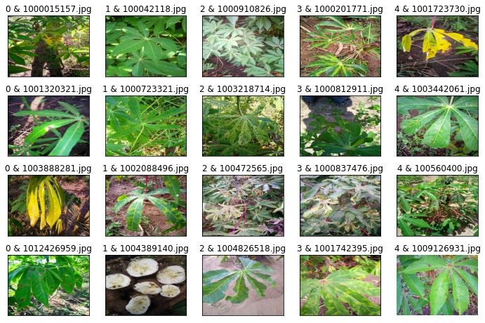

# Kaggle: Image classification challenges


[](https://github.com/Borda/kaggle_image-classify/actions/workflows/code-format.yml)
[](https://codecov.io/gh/Borda/kaggle_image-classify)
[](https://results.pre-commit.ci/latest/github/Borda/kaggle_image-classify/main)

## Experimentation

### install this tooling

A simple way how to use this basic functions:

```bash
! pip install https://github.com/Borda/kaggle_image-classify/archive/main.zip
```

## Kaggle: [Herbarium 2022](https://www.kaggle.com/competitions/herbarium-2022-fgvc9)

The Herbarium 2022: Flora of North America dataset comprises 1.05 M images of 15,501 vascular plants, which constitute more than 90% of the taxa documented in North America. The provided dataset is constrained to include only vascular land plants (lycophytes, ferns, gymnosperms, and flowering plants) and it has a long-tail distribution. The number of images per taxon is as few as seven and as many as 100 images. Although more images are available.



### run notebooks in Kaggle

- [🌿Herbarium: EDA 🔎 & baseline Flash⚡EfficientNet](https://www.kaggle.com/code/jirkaborovec/herbarium-eda-baseline-flash-efficientnet)
- [🌿Herbarium: Lightning⚡Flash (inference)](https://www.kaggle.com/code/jirkaborovec/herbarium-lightning-flash-inference)

### run notebooks in Colab

- [🌿Herbarium with Lit⚡Flash & EfficientNet](https://colab.research.google.com/github/Borda/kaggle_image-classify/blob/main/notebooks/Herbarium-with-Flash-EfficientNet.ipynb)

### some results

Training progress with EffNet-b3 with training  for 10 epochs:



## Kaggle: [Plant Pathology 2021 - FGVC8](https://www.kaggle.com/c/plant-pathology-2021-fgvc8)

Foliar (leaf) diseases pose a major threat to the overall productivity and quality of apple orchards.
The current process for disease diagnosis in apple orchards is based on manual scouting by humans, which is time-consuming and expensive.

The main objective of the competition is to develop machine learning-based models to accurately classify a given leaf image from the test dataset to a particular disease category, and to identify an individual disease from multiple disease symptoms on a single leaf image.



### run notebooks in Kaggle

- [Plant Pathology with Flash](https://www.kaggle.com/jirkaborovec/plant-pathology-with-pytorch-lightning-flash)
- [Plant Pathology with Lightning ⚡](https://www.kaggle.com/jirkaborovec/plant-pathology-with-lightning)
- [Plant Pathology with Lightning \[predictions\]](https://www.kaggle.com/jirkaborovec/plant-pathology-with-lightning-predictions)

### run notebooks in Colab

- [Plant pathology with Lightning](https://colab.research.google.com/github/Borda/kaggle_image-classify/blob/main/notebooks/Plant-Pathology-with-Lightning.ipynb)
- [Plant pathology with Lightning - StandAlone](https://colab.research.google.com/github/Borda/kaggle_image-classify/blob/main/notebooks/Plant-Pathology-with-Lightning_standalone.ipynb) (without this package)
- [Plant pathology with Flash](https://colab.research.google.com/github/Borda/kaggle_image-classify/blob/main/notebooks/Plant-Pathology-with-Flash.ipynb)

I would recommend uploading the dataset to you personal gDrive and then in notebooks connect the gDrive which saves you lost of time with re-uploading dataset when ever your Colab is reset... :\]

### some results

Training progress with ResNet50 with training  for 10 epochs > over 96% validation accuracy:



### More reading

- [Practical Lighting Tips to Rank on Kaggle Image Challenges](https://devblog.pytorchlightning.ai/practical-tips-to-rank-on-kaggle-image-challenges-with-lightning-242e2e533429)

## Kaggle: [iMet Collection 2021 x AIC - FGVC8](https://www.kaggle.com/c/imet-2021-fgvc8)

The online cataloguing information is generated by subject matter experts and includes a wide range of data. These include, but are not limited to: multiple object classifications, artist, title, period, date, medium, culture, size, provenance, geographic location, and other related museum objects within The Met’s collection.
Adding fine-grained attributes to aid in the visual understanding of the museum objects will enable the ability to search for visually related objects.



### run notebooks in Kaggle

- [iMet Collection with Lightning ⚡](https://www.kaggle.com/jirkaborovec/imet-with-lightning)

### run notebooks in Colab

- [iMet Collection with Lightning with ResNet50](https://colab.research.google.com/github/Borda/kaggle_image-classify/blob/main/notebooks/iMet-with-Lightning.ipynb)
- [iMet Collection with Lightning and VisionTransformers from TIMM](https://colab.research.google.com/github/Borda/kaggle_image-classify/blob/main/notebooks/iMet-with-Lightning-and-ViT.ipynb)

I would recommend uploading the dataset to you personal gDrive and then in notebooks connect the gDrive which saves you lost of time with re-uploading dataset when ever your Colab is reset... :\]

### some results

Training progress with ResNet50 with training for 35 epochs and subset labels with ore then 100 samples:



## Kaggle: [Cassava Leaf Disease Classification](https://www.kaggle.com/c/cassava-leaf-disease-classification/overview)

The task is to classify each cassava image into five categories indicating - plant with a certain kind of disease or healthy leaf.

Organizers introduced a dataset of 21,367 labeled images collected during a regular survey in Uganda. Most images were crowd-sourced from farmers taking photos of their gardens, and annotated by experts at the National Crops Resources Research Institute (NaCRRI) in collaboration with the AI lab at Makerere University, Kampala.



### run notebooks in Colab

- [Cassava with Lightning](https://colab.research.google.com/github/Borda/kaggle_image-classify/blob/main/notebooks/Cassava_with_Lightning.ipynb)
- [Cassava with Flash](https://colab.research.google.com/github/Borda/kaggle_image-classify/blob/main/notebooks/Cassava_with_Flash.ipynb)

I would recommend uploading the dataset to you personal gDrive and then in notebooks connect the gDrive which saves you lost of time with re-uploading dataset when ever your Colab is reset... :\]

### some results

Training progress with ResNet50 with training  for 10 epochs:


