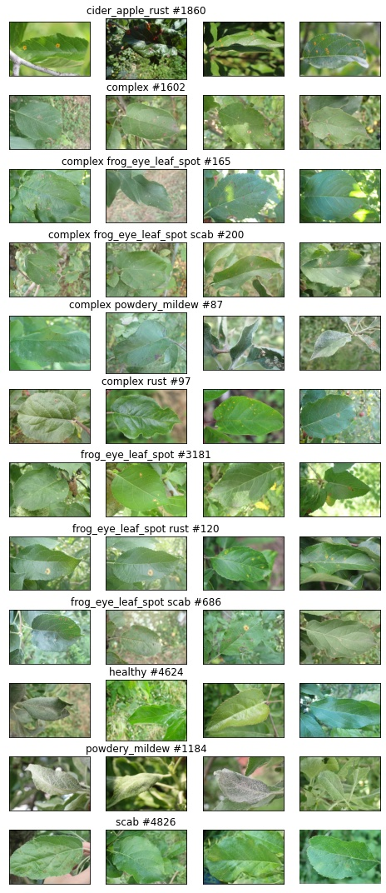

# Kaggle: [Cassava Leaf Disease Classification](https://www.kaggle.com/c/cassava-leaf-disease-classification/overview)


The task is to classify each cassava image into five categories indicating - plant with a certain kind of disease or healthy leaf. 

Organizers introduced a dataset of 21,367 labeled images collected during a regular survey in Uganda. Most images were crowd-sourced from farmers taking photos of their gardens, and annotated by experts at the National Crops Resources Research Institute (NaCRRI) in collaboration with the AI lab at Makerere University, Kampala.



It seems that there are already a few [submissions/notebooks with PL](https://www.kaggle.com/c/cassava-leaf-disease-classification/notebooks?competitionId=13836&searchQuery=lightning).

## Experimentation

### install this tooling

A simple way how to use this basic functions:
```bash
! pip install https://github.com/Borda/kaggle_cassava-leaf-disease/archive/main.zip
```

### run notebooks in Colab

* [Cassava with Lightning](https://colab.research.google.com/github/Borda/kaggle_cassava-leaf-disease/blob/main/notebooks/Cassava_with_Lightning.ipynb)
* [Cassava with Flash](https://colab.research.google.com/github/Borda/kaggle_cassava-leaf-disease/blob/main/notebooks/Cassava_with_Flash.ipynb)

I would recommend to upload the dataset to you personal gDrive and then in notebooks connect the gDrive wich saves you lost of time with re-uploading dataset when ever your Colab is reseted... :]

